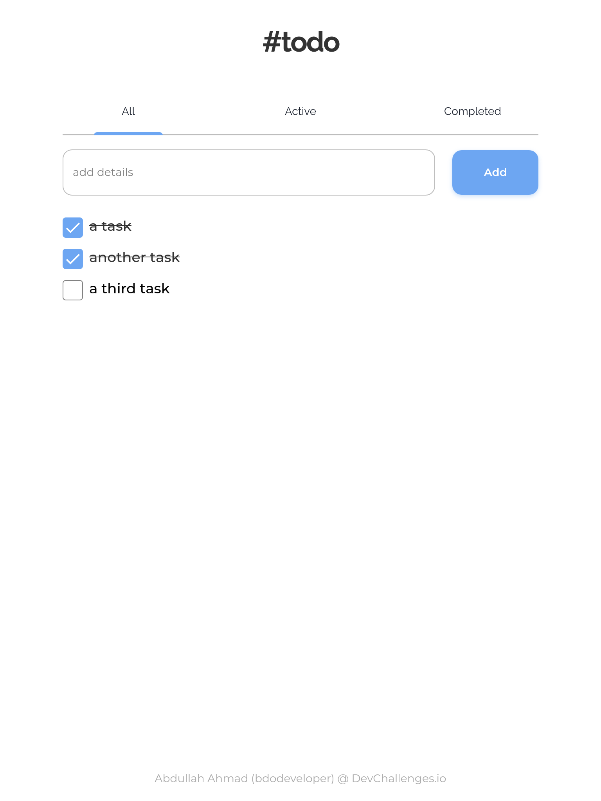

<h1 align="center">Todo App</h1>

<div align="center">
   Solution for a challenge from  <a href="http://devchallenges.io" target="_blank">Devchallenges.io</a>.
</div>

<div align="center">
  <h3>
    <a href="https://devchallenges-todo-app.vercel.app" target="_blank">
      Demo
    </a>
    <span> | </span>
    <a href="https://github.com/bdodeveloper/devchallenges-todo-app" target="_blank">
      Solution
    </a>
    <span> | </span>
    <a href="https://devchallenges.io/challenges/hH6PbOHBdPm6otzw2De5" target="_blank">
      Challenge
    </a>
    <span> | </span>
    <a href="https://www.figma.com/file/SClDA1weEGA3Mo8Is8Sbf2/todo" target="_blank">
      Design
    </a>
  </h3>
</div>

<!-- TABLE OF CONTENTS -->

## Table of Contents

- [Overview](#overview)
  - [Built With](#built-with)
- [Features](#features)
- [How to use](#how-to-use)
- [Contact](#contact)
- [Acknowledgements](#acknowledgements)

<!-- OVERVIEW -->

## Overview



### Built With

<!-- This section should list any major frameworks that you built your project using. Here are a few examples.-->

- [React](https://reactjs.org)
- [Tailwind CSS](https://tailwindcss.com)

## Features

<!-- List the features of your application or follow the template. Don't share the figma file here :) -->

This application was created as a submission to a [DevChallenges](https://devchallenges.io/challenges) challenge. The [challenge](https://devchallenges.io/challenges/hH6PbOHBdPm6otzw2De5) was to build an application to complete the given user stories.

## How To Use

<!-- This is an example, please update according to your application -->

To clone and run this application, you'll need [Git](https://git-scm.com) and [Node.js](https://nodejs.org/en/download) (which comes with [npm](https://www.npmjs.com/)) installed on your computer. You can use [Yarn](https://yarnpkg.com) instead of npm, and it's up to you. From your command line:

```bash
# Clone this repository
$ git clone https://github.com/bdodeveloper/devchallenges-todo-app

# Move to the project directory
$ cd devchallenges-todo-app

# Install dependencies
$ npm install
# or
$ yarn

# Run the app
$ npm start
# or
$ yarn start
```

## Contact

- GitHub [@bdodeveloper](https://github.com/bdodeveloper)
- Twitter [@bdodeveloper](https://twitter.com/bdodeveloper)
